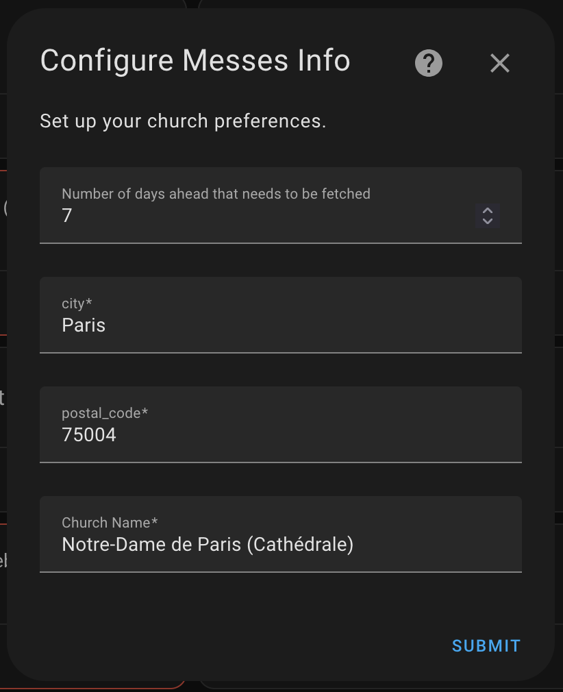
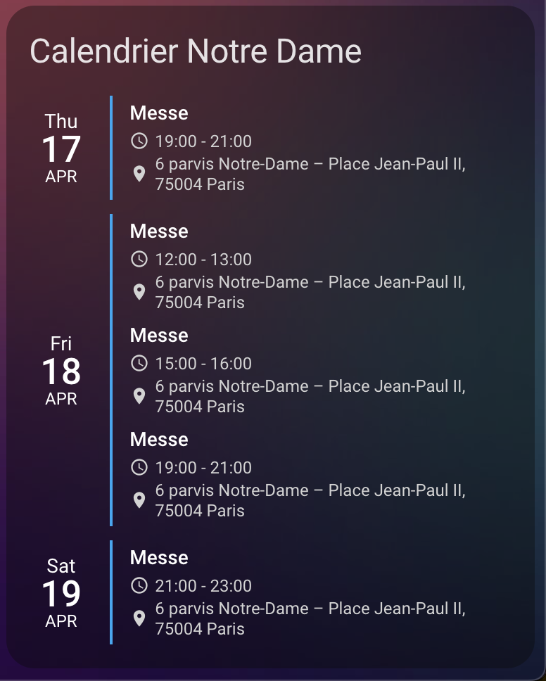

# Messes Info (unofficial)

Messes Info (unofficial) is a custom Home Assistant Community Store (HACS) integration that fetches mass data from the [https://messes.info](https://messes.info) website using its GWT API. This integration allows you to display mass schedules directly in your Home Assistant instance.

## Features

- Fetches mass schedules from the Messes Info website.
- Displays mass schedules in the Home Assistant calendar platform.
- Supports cloud polling for data updates.

## Installation

### Prerequisites

- Home Assistant version 2023.0.0 or later.
- HACS (Home Assistant Community Store) installed in your Home Assistant instance.

### Steps to Install

1. Open HACS in your Home Assistant instance.
2. Go to the "Integrations" section.
3. Click on the three-dot menu in the top-right corner and select "Custom repositories."
4. Add the following repository URL: `https://github.com/thamin-i/hacs_messes_info` and select the category as "Integration."
5. Search for "Messes Info (unofficial)" in the HACS Integrations section and click "Install."
6. Restart Home Assistant to complete the installation.

## Configuration

1. After restarting Home Assistant, go to **Settings** > **Devices & Services** > **Integrations**.
2. Click on "Add Integration" and search for "Messes Info (unofficial)".
3. Follow the on-screen instructions to configure the integration (find your church informations on [messes.info](https://messes.info)).

## Requirements

This integration requires the following Python libraries, which are automatically installed:

- `aiohttp~=3.11.16`
- `voluptuous~=0.15.2`

## Integration Details

- **Domain**: `messes_info`
- **Platforms**: `calendar`
- **IoT Class**: Cloud Polling
- **Integration Type**: Integration

## Suggested Use with Calendar Card Pro

To enhance the display of your mass schedules, consider using the [Calendar Card Pro](https://github.com/alexpfau/calendar-card-pro) custom Lovelace card. This card provides a beautiful and customizable way to display calendar events in your Home Assistant dashboard.

## Troubleshooting

If you encounter any issues:

1. Ensure that your Home Assistant version meets the minimum requirement (2023.0.0).
2. Verify that the Messes Info website is accessible from your network.
3. Check the Home Assistant logs for error messages related to the `messes_info` integration.

## Contributing

Contributions are welcome! If you would like to contribute to this project, please open an issue or submit a pull request on the [GitHub repository](https://github.com/thamin-i/hacs_messes_info).

## License

This project is licensed under the MIT License. See the [LICENSE](LICENSE) file for details.

## Acknowledgments

- API reverse-engineered with the help of the [MassAPI](https://github.com/lologhi/MassAPI.git) repository.

## Screenshots

Here are some screenshots of the integration in action:

### Integration Setup

### Calendar View

